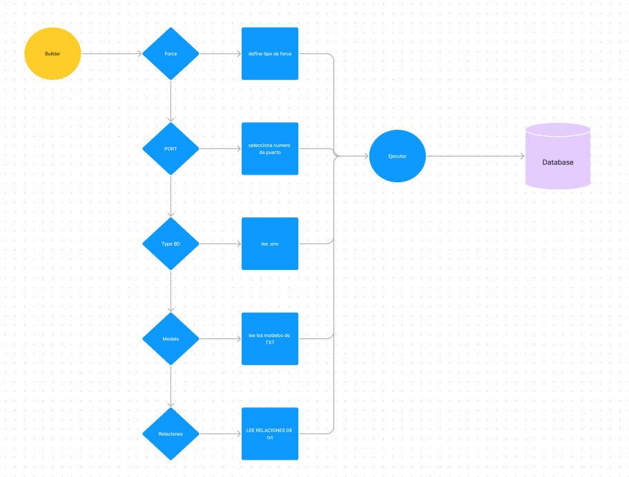
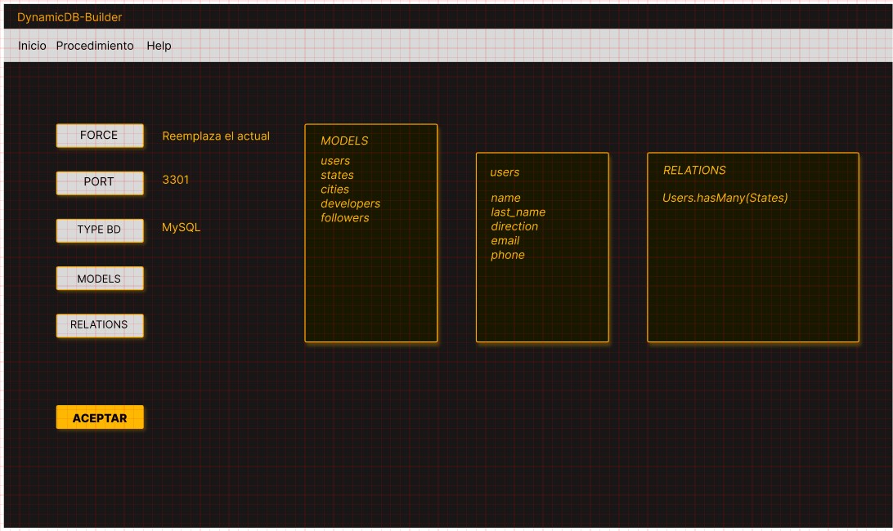

# DynamicDB-Builder

>Esta herramienta realizada en Electron y Node está pensada para automatizar la construcción de bases de datos. Llamaremos de backend-falso, el constructor será útil para levantar bases de datos y sus tablas de una manera veloz e ir intercambiando entre varias bases de datos a modo de prueba.
>Además de servir como ejemplo de una app realizada con Node y con Electro que simula una app de escritorio. Esta no requiere de instalador pero si es necesario descargar la carpeta con los archivos y hacer un acceso directo del .exe llamado DynamicDB-Builder. 

## Conceptos

El **builder** tiene muy pocos pasos para su funcionamiento, una serie de botones que explican por sí mismos la información requerida, estas informaciones algunas, son de selección simple otras consisten en la lectura de archivos TXT. Completando la información el constructor estará configurado para armar la base de datos con sus tablas.
Tener en cuenta que para las tablas `relacionales` se necesitará un archivo TXT que reflejen las relaciones necesarias.

El contructor sirve para levantar bases de datos con sus tablas y sus relaciones, si las tienel pero no olvidar que luego el manejo de la base de datos y sus tablas deberá estar programado en el backend correpondiente.

En la pantalla principal se puede encontrar un menú simple, con **Inicio** puedes realizar una construcción nueva o abrir una ya utilizada anteriormente o salir del constructor y luego tenemos los créditos en **Acerca**.

>Nota: el contructor no utiliza una base de datos paraguardar info de su configuración, todo lo hace con archivos del tipo TXT.

## Funcionamiento

Hacemos click en **Force** para detallar el tipo de acción que queremos que el constructor realice. Como la conexión con la base de datos se realiza con `Sequelize` necesitamos aclarar el modelo de sincronización. Al utilizar el modelo `model.sync()` este modelo crea la tabla si esta no existe y si existe no realiza nada. Si usamos `sync({ force: true})`, esta crea la tabla dropeando la existente. Con `sync({ alter: truee})`, esta verifica el estado actual de la tabla en la base de datos y luego realiza los cambios necesarios en la tabla para que coincida con el modelo.
Al seleccionar un tipo queda escrito el mismo al lado del botón.
Al hacer click en **Port** optamos por el puerto necesario según nuestra base de datos.
Al seleccionar **Type BD** podemos optar por los tipos relacionales o no relacionales existentes.

Las configuraciones que vienen a continuación son las que vana definir la estructura d ela base de datos, de sus tablas y de sus relaciones. Al presionar el botón de **Models** podemos seleccionar un archivo en formato de TXT que contenga los nombres de las tablas y de los campos como de sus propiedades, recordar que el formato de sintaxis debe ser la que utiliza `Sequelize`. Al terminar con la carga esta quedará plasmada en un cuadro siguiente con el título de **Models**.  Si hacemos click sobre cada modelo o tabla podemos ver los campos y sus propiedades. Si este modelo fuera un o relacional tendremos que hacer click sobre el botón **Relations** y cargaremos otro archivo de texto con la información de las relaciones.

Terminada la configuración el sitema detectará que está listo para conectarse con la base de datos y va a comenzar a armar su estructura. Te avisará que está ok y podrás presionar el botón de **Aceptar**

## Tecnologías

## Autor

